# Order Saga - Complete Detailed Sequence Diagram

This comprehensive diagram shows the complete Order Saga flow including all participants, events, commands, state transitions, and error handling scenarios in a single view.

## Complete Order Saga Flow

```mermaid
sequenceDiagram
    participant Client
    participant OrderService
    participant OrderSaga
    participant PaymentService
    participant InventoryService
    participant Kafka
    participant Database

    Note over Client,Database: Complete Order Saga Flow with All Scenarios

    %% Initial Order Creation
    Client->>OrderService: Create Order Request
    OrderService->>Database: Save Order
    OrderService->>Kafka: OrderCreatedEvent (ord-ord-req-succ-event)
    Kafka->>OrderSaga: OrderCreatedListener.handleOrderCreated()
    
    %% Saga Initialization
    OrderSaga->>Database: Create SagaInstance (ORDER_CREATED)
    OrderSaga->>OrderSaga: StateMachine.startReactively()
    OrderSaga->>OrderSaga: StateMachine.sendEvent(START_ORDER)
    Note over OrderSaga: State: ORDER_CREATED → PAYMENT_REQUESTED
    
    %% Payment Request Phase
    OrderSaga->>OrderSaga: PaymentCommandGateway.paymentRequestCommand()
    OrderSaga->>Database: Create SagaStep (paymentRequestCommand, IN_PROGRESS)
    OrderSaga->>Database: Create OutboxEvent (PaymentRequest, PENDING)
    OrderSaga->>Kafka: PaymentRequestPayload (ord-pay-req-cmd)
    Kafka->>PaymentService: Process Payment Request
    
    %% Payment Response Handling
    alt Payment Success
        PaymentService->>Kafka: PaymentSucceedEvent (ord-pay-req-succ-evt)
        Kafka->>OrderSaga: PaymentRequestListener.handlePaymentSuccess()
        OrderSaga->>Database: Update SagaStep Status (DONE)
        OrderSaga->>OrderSaga: StateMachine.sendEvent(PAYMENT_SUCCESS)
        Note over OrderSaga: State: PAYMENT_REQUESTED → INVENTORY_RESRVING
        
        %% Inventory Request Phase
        OrderSaga->>OrderSaga: InventoryCommandGateway.inventoryReserveCommand()
        loop For Each Order Item
            OrderSaga->>Database: Create SagaStep (inventoryReserve, IN_PROGRESS)
            OrderSaga->>Database: Create OutboxEvent (inventoryReserve, PENDING)
            OrderSaga->>Kafka: InventoryReservePayload (ord-inv-dec-cmd)
            Kafka->>InventoryService: Process Inventory Reserve
        end
        
        %% Inventory Response Handling
        alt Inventory Success
            InventoryService->>Kafka: InventoryReserveSucceedEvent (ord-inv-dec-succ-evt)
            Kafka->>OrderSaga: InventoryReserveListener.handleInventoryReserveSuccess()
            OrderSaga->>Database: Update SagaStep Status (DONE)
            OrderSaga->>OrderSaga: StateMachine.sendEvent(INVENTORY_SUCCESS)
            Note over OrderSaga: State: INVENTORY_RESRVING → ORDER_COMPLETED
            OrderSaga->>Database: Update SagaInstance Status (ORDER_COMPLETED)
            OrderSaga->>Client: Order Completed Successfully
            
        else Inventory Failure
            InventoryService->>Kafka: InventoryReserveFailedEvent (ord-inv-dec-fail-evt)
            Kafka->>OrderSaga: InventoryReserveListener.handleInventoryReserveFailure()
            OrderSaga->>Database: Update SagaStep Status (FAILED)
            OrderSaga->>OrderSaga: StateMachine.sendEvent(INVENTORY_FAILURE)
            Note over OrderSaga: State: INVENTORY_RESRVING → COMPENSATING_PAYMENT
            
            %% Payment Compensation Phase
            OrderSaga->>OrderSaga: PaymentCommandGateway.inventoryFailurePaymentCompensateCommand()
            OrderSaga->>Database: Create SagaStep (inventoryFailurePaymentCompensate, COMPENSATING)
            OrderSaga->>Database: Create OutboxEvent (inventoryFailurePaymentCompensate, PENDING)
            OrderSaga->>Kafka: PayInvCompPayload (ord-pay-inv-comp-req)
            Kafka->>PaymentService: Process Payment Compensation
            
            %% Payment Compensation Response
            alt Payment Compensation Success
                PaymentService->>Kafka: PayInvCompSuccessEvent (ord-pay-inv-comp-succ-evt)
                Kafka->>OrderSaga: InvPayCompListener.handlePayInvCompSuccessEvent()
                OrderSaga->>Database: Update SagaStep Status (COMPENSATED)
                OrderSaga->>OrderSaga: StateMachine.sendEvent(PAYMENT_COMPENSATED)
                Note over OrderSaga: State: COMPENSATING_PAYMENT → COMPENSATING_INVENTORY
                
                %% Inventory Compensation Phase
                OrderSaga->>OrderSaga: InventoryCommandGateway.inventoryFailureInventoryCompensateCommand()
                OrderSaga->>Database: Create SagaStep (inventoryFailureInventoryCompensate, COMPENSATING)
                OrderSaga->>Database: Create OutboxEvent (inventoryFailureInventoryCompensate, PENDING)
                OrderSaga->>Kafka: InvInvCompPayload (ord-inv-inv-comp-req)
                Kafka->>InventoryService: Process Inventory Compensation
                
                %% Inventory Compensation Response
                alt Inventory Compensation Success
                    InventoryService->>Kafka: InvInvCompSuccessEvent (ord-inv-inv-comp-succ-evt)
                    Kafka->>OrderSaga: InvInvCompListener.handleInvInvCompSuccessEvent()
                    OrderSaga->>Database: Update SagaStep Status (COMPENSATED)
                    OrderSaga->>OrderSaga: StateMachine.sendEvent(INVENTORY_COMPENSATED)
                    Note over OrderSaga: State: COMPENSATING_INVENTORY → COMPENSATED
                    OrderSaga->>Database: Update SagaInstance Status (COMPENSATED)
                    OrderSaga->>Client: Order Compensated Successfully
                    
                else Inventory Compensation Failure
                    InventoryService->>Kafka: InvInvCompFailEvent (ord-inv-inv-comp-fail-evt)
                    Kafka->>OrderSaga: InvInvCompListener.handleInvInvCompFailEvent()
                    OrderSaga->>Database: Update SagaStep Status (FAILED)
                    OrderSaga->>OrderSaga: StateMachine.sendEvent(INVENTORY_COMPENSATE_FAIL)
                    Note over OrderSaga: State: COMPENSATING_INVENTORY → FAILED
                    OrderSaga->>OrderSaga: InventoryCommandGateway.inventoryInventoryCompensateFailDLQ()
                    OrderSaga->>Database: Update SagaInstance Status (FAILED)
                    OrderSaga->>Client: Order Failed - Compensation Failed
                end
                
            else Payment Compensation Failure
                PaymentService->>Kafka: PayInvCompFailEvent (ord-pay-inv-comp-fail-evt)
                Kafka->>OrderSaga: InvPayCompListener.handlePayInvCompFailEvent()
                OrderSaga->>Database: Update SagaStep Status (FAILED)
                OrderSaga->>OrderSaga: StateMachine.sendEvent(PAYMENT_COMPENSATE_FAIL)
                Note over OrderSaga: State: COMPENSATING_PAYMENT → FAILED
                OrderSaga->>OrderSaga: PaymentCommandGateway.paymentInventoryCompensateFailDLQ()
                OrderSaga->>Database: Update SagaInstance Status (FAILED)
                OrderSaga->>Client: Order Failed - Payment Compensation Failed
            end
        end
        
    else Payment Failure
        PaymentService->>Kafka: PaymentFailedEvent (ord-pay-req-fail-evt)
        Kafka->>OrderSaga: PaymentRequestListener.handlePaymentFailure()
        OrderSaga->>Database: Update SagaStep Status (FAILED)
        OrderSaga->>OrderSaga: StateMachine.sendEvent(PAYMENT_FAILURE)
        Note over OrderSaga: State: PAYMENT_REQUESTED → FAILED
        OrderSaga->>Database: Update SagaInstance Status (FAILED)
        OrderSaga->>Client: Order Failed - Payment Failed
    end
```

## Key Components in Detail

### **Participants:**
- **Client**: External system initiating order creation
- **OrderService**: Service that creates orders and publishes events
- **OrderSaga**: Saga orchestrator managing the entire flow
- **PaymentService**: External payment processing service
- **InventoryService**: External inventory management service
- **Kafka**: Message broker for event-driven communication
- **Database**: Persistence layer for saga state and steps

### **Events and Commands:**

#### **Events (Incoming):**
- `OrderCreatedEvent` → Triggers saga initiation
- `PaymentSucceedEvent` → Payment successful
- `PaymentFailedEvent` → Payment failed
- `InventoryReserveSucceedEvent` → Inventory reservation successful
- `InventoryReserveFailedEvent` → Inventory reservation failed
- `PayInvCompSuccessEvent` → Payment compensation successful
- `PayInvCompFailEvent` → Payment compensation failed
- `InvInvCompSuccessEvent` → Inventory compensation successful
- `InvInvCompFailEvent` → Inventory compensation failed

#### **Commands (Outgoing):**
- `PaymentRequestPayload` → Request payment processing
- `InventoryReservePayload` → Request inventory reservation
- `PayInvCompPayload` → Request payment compensation
- `InvInvCompPayload` → Request inventory compensation

### **State Transitions:**
1. `ORDER_CREATED` → `PAYMENT_REQUESTED` (START_ORDER)
2. `PAYMENT_REQUESTED` → `INVENTORY_RESRVING` (PAYMENT_SUCCESS)
3. `PAYMENT_REQUESTED` → `FAILED` (PAYMENT_FAILURE)
4. `INVENTORY_RESRVING` → `ORDER_COMPLETED` (INVENTORY_SUCCESS)
5. `INVENTORY_RESRVING` → `COMPENSATING_PAYMENT` (INVENTORY_FAILURE)
6. `COMPENSATING_PAYMENT` → `COMPENSATING_INVENTORY` (PAYMENT_COMPENSATED)
7. `COMPENSATING_PAYMENT` → `FAILED` (PAYMENT_COMPENSATE_FAIL)
8. `COMPENSATING_INVENTORY` → `COMPENSATED` (INVENTORY_COMPENSATED)
9. `COMPENSATING_INVENTORY` → `FAILED` (INVENTORY_COMPENSATE_FAIL)

### **Database Operations:**
- **SagaInstance**: Created at start, updated with final status
- **SagaStep**: Created for each command, updated with execution status
- **OutboxEvent**: Created for reliable event publishing

### **Error Handling:**
- **Payment Failure**: Immediate failure, no compensation needed
- **Inventory Failure**: Triggers payment compensation, then inventory compensation
- **Compensation Failure**: Moves to FAILED state with DLQ handling

### **Key Features:**
1. **Event-Driven**: All communication via Kafka events
2. **State Machine**: Spring State Machine for orchestration
3. **Compensation**: Automatic rollback on failures
4. **Persistence**: Complete audit trail of all steps
5. **Idempotency**: UUID-based step tracking
6. **Reliability**: Outbox pattern for guaranteed delivery 