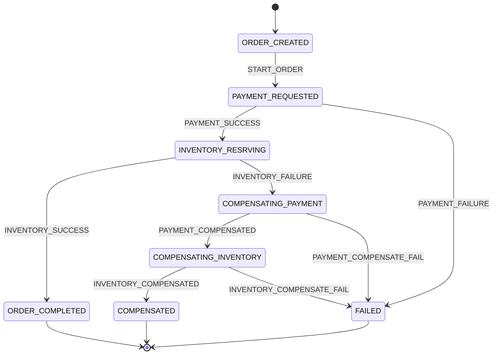
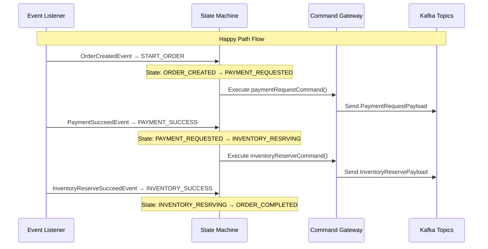
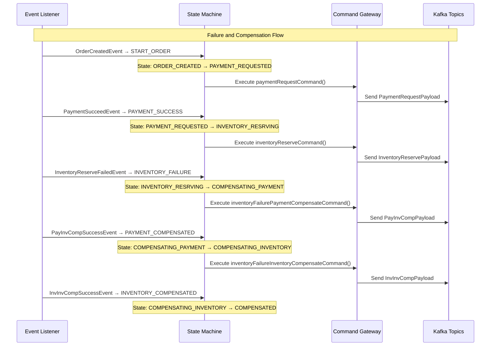

# Order Saga - Simplified State Machine Flow

This diagram focuses on the core state machine transitions, events, and commands in the Order Saga system.

## State Machine Transitions Overview

## Simplified Sequence Flow

## Failure and Compensation Flow

## Event → State → Command Mapping

| Event | State Transition | Command Executed |
|-------|------------------|------------------|
| `OrderCreatedEvent` | `ORDER_CREATED` → `PAYMENT_REQUESTED` | `paymentRequestCommand()` |
| `PaymentSucceedEvent` | `PAYMENT_REQUESTED` → `INVENTORY_RESRVING` | `inventoryReserveCommand()` |
| `PaymentFailedEvent` | `PAYMENT_REQUESTED` → `FAILED` | None (End State) |
| `InventoryReserveSucceedEvent` | `INVENTORY_RESRVING` → `ORDER_COMPLETED` | None (End State) |
| `InventoryReserveFailedEvent` | `INVENTORY_RESRVING` → `COMPENSATING_PAYMENT` | `inventoryFailurePaymentCompensateCommand()` |
| `PayInvCompSuccessEvent` | `COMPENSATING_PAYMENT` → `COMPENSATING_INVENTORY` | `inventoryFailureInventoryCompensateCommand()` |
| `PayInvCompFailEvent` | `COMPENSATING_PAYMENT` → `FAILED` | `paymentInventoryCompensateFailDLQ()` |
| `InvInvCompSuccessEvent` | `COMPENSATING_INVENTORY` → `COMPENSATED` | None (End State) |
| `InvInvCompFailEvent` | `COMPENSATING_INVENTORY` → `FAILED` | `inventoryInventoryCompensateFailDLQ()` |

## Key Commands and Their Payloads

| Command | Payload | Kafka Topic |
|---------|---------|-------------|
| `paymentRequestCommand()` | `PaymentRequestPayload` | `ord-pay-req-cmd` |
| `inventoryReserveCommand()` | `InventoryReservePayload` | `ord-inv-dec-cmd` |
| `inventoryFailurePaymentCompensateCommand()` | `PayInvCompPayload` | `ord-pay-inv-comp-req` |
| `inventoryFailureInventoryCompensateCommand()` | `InvInvCompPayload` | `ord-inv-inv-comp-req` |

## State Machine Configuration Summary

The state machine is configured with:
- **Initial State**: `ORDER_CREATED`
- **End States**: `ORDER_COMPLETED`, `FAILED`, `COMPENSATED`
- **Transitions**: 9 transitions based on events
- **Actions**: Commands executed during state transitions
- **Persistence**: JPA-based state machine persister 